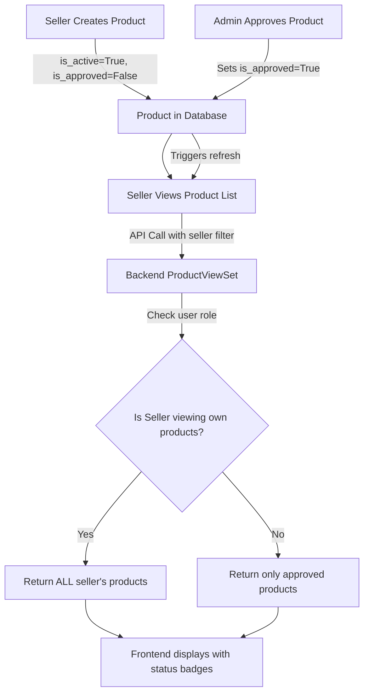

# Product Status Update Fix - Implementation Plan

## Problem Statement

When an admin approves a product, the seller's product list page doesn't reflect the status change. Products remain showing as "Inactive" even after admin approval because:

1. **Backend API Filtering Issue**: The [`ProductViewSet`](bloquesite/amazon_clone/views.py:111) filters products by `is_active=True` at line 111, which excludes newly created products that are pending approval
2. **No Real-time Updates**: The seller's product list doesn't automatically refresh after admin approval
3. **Status Display Logic**: The frontend only shows `is_active` status, not the `is_approved` status

## Root Cause Analysis

### Backend Issue (Primary)
In [`views.py:111`](bloquesite/amazon_clone/views.py:111):
```python
queryset = Product.objects.filter(is_active=True)
```

This means:
- When a seller creates a product, it has `is_active=True` but `is_approved=False`
- The product appears in the seller's list initially
- When admin approves it, both `is_active=True` and `is_approved=True` are set
- However, the queryset already filters by `is_active=True`, so the issue is actually in the **permission logic**

### Actual Root Cause
Looking at [`views.py:132-149`](bloquesite/amazon_clone/views.py:132-149), the `get_queryset()` method doesn't differentiate between:
- **Public users** (should only see approved products)
- **Sellers viewing their own products** (should see all their products regardless of approval status)
- **Admins** (should see all products)

## Solution Design

### Architecture Overview



### Implementation Strategy

#### Phase 1: Backend Changes (Critical)

**File**: [`bloquesite/amazon_clone/views.py`](bloquesite/amazon_clone/views.py:132)

**Change 1**: Modify `get_queryset()` method to handle seller's own products

```python
def get_queryset(self):
    queryset = Product.objects.all()  # Start with all products
    user = self.request.user
    
    # If filtering by seller parameter and user is that seller, show all their products
    seller_id = self.request.query_params.get('seller')
    if seller_id and user.is_authenticated and str(user.id) == str(seller_id):
        # Seller viewing their own products - show all regardless of approval
        queryset = queryset.filter(seller=user)
    else:
        # Public view or other users - only show approved and active products
        queryset = queryset.filter(is_active=True, is_approved=True)
    
    # Apply price range filters
    min_price = self.request.query_params.get('min_price')
    max_price = self.request.query_params.get('max_price')
    if min_price:
        queryset = queryset.filter(price__gte=min_price)
    if max_price:
        queryset = queryset.filter(price__lte=max_price)
    
    return queryset
```

**Change 2**: Update serializers to include `is_approved` field

**File**: [`bloquesite/amazon_clone/serializers.py`](bloquesite/amazon_clone/serializers.py)

Ensure `ProductListSerializer` includes:
```python
class ProductListSerializer(serializers.ModelSerializer):
    # ... existing fields ...
    is_approved = serializers.BooleanField(read_only=True)
```

#### Phase 2: Frontend Changes

**File**: [`bloquesite/frontend/src/pages/seller/Products.js`](bloquesite/frontend/src/pages/seller/Products.js:91-96)

**Change 1**: Update status badge logic to show approval status

```javascript
<td>
  {product.is_approved ? (
    product.is_active ? (
      <Badge bg="success">Active</Badge>
    ) : (
      <Badge bg="secondary">Inactive</Badge>
    )
  ) : (
    <Badge bg="warning" text="dark">
      <i className="bi bi-clock me-1"></i>
      Pending Approval
    </Badge>
  )}
</td>
```

**Change 2**: Add auto-refresh mechanism (optional but recommended)

```javascript
useEffect(() => {
  fetchProducts();
  
  // Set up polling every 30 seconds to check for status updates
  const interval = setInterval(() => {
    fetchProducts();
  }, 30000);
  
  return () => clearInterval(interval);
}, []);
```

**Change 3**: Add manual refresh button

```javascript
<div className="d-flex justify-content-between align-items-center mb-4">
  <h1 style={{ fontFamily: 'var(--font-display)' }}>
    {t('seller.products')}
  </h1>
  <div>
    <Button 
      variant="outline-secondary" 
      className="me-2"
      onClick={fetchProducts}
      disabled={loading}
    >
      <i className="bi bi-arrow-clockwise me-2"></i>
      Refresh
    </Button>
    <Link to="/seller/products/new" className="btn btn-primary">
      <i className="bi bi-plus-circle me-2"></i>
      {t('seller.addProduct')}
    </Link>
  </div>
</div>
```

## Implementation Steps

### Step 1: Backend API Fix
1. Modify [`ProductViewSet.get_queryset()`](bloquesite/amazon_clone/views.py:132) to allow sellers to see all their products
2. Verify serializers include `is_approved` field
3. Test API endpoint: `GET /api/products/?seller={seller_id}`

### Step 2: Frontend Status Display
1. Update status badge in [`Products.js`](bloquesite/frontend/src/pages/seller/Products.js:91) to show three states:
   - "Pending Approval" (yellow) - `is_approved=False`
   - "Active" (green) - `is_approved=True, is_active=True`
   - "Inactive" (gray) - `is_approved=True, is_active=False`

### Step 3: Add Refresh Mechanism
1. Add manual refresh button
2. Optionally add auto-refresh polling (every 30-60 seconds)
3. Show loading state during refresh

### Step 4: Testing
1. Create a new product as seller → Should show "Pending Approval"
2. Approve product as admin → Status should update to "Active"
3. Deactivate product → Status should show "Inactive"
4. Test refresh button functionality

## Files to Modify

### Backend
- [`bloquesite/amazon_clone/views.py`](bloquesite/amazon_clone/views.py:132-149) - Modify `get_queryset()` method
- [`bloquesite/amazon_clone/serializers.py`](bloquesite/amazon_clone/serializers.py) - Verify `is_approved` field inclusion

### Frontend
- [`bloquesite/frontend/src/pages/seller/Products.js`](bloquesite/frontend/src/pages/seller/Products.js:91-96) - Update status display logic
- [`bloquesite/frontend/src/pages/seller/Products.js`](bloquesite/frontend/src/pages/seller/Products.js:53-61) - Add refresh button

## Expected Behavior After Fix

1. **Seller creates product**:
   - Product appears immediately in seller's list
   - Status shows "Pending Approval" (yellow badge)

2. **Admin approves product**:
   - Product status changes to `is_approved=True`
   - Seller refreshes page (manually or auto-refresh)
   - Status updates to "Active" (green badge)

3. **Product visibility**:
   - Sellers see ALL their products (pending, approved, inactive)
   - Public users only see approved & active products
   - Admins see all products in admin dashboard

## Alternative Solutions Considered

### Option 1: WebSocket Real-time Updates
- **Pros**: Instant updates without polling
- **Cons**: Requires additional infrastructure (Redis, Django Channels)
- **Decision**: Not recommended for MVP, can be added later

### Option 2: Server-Sent Events (SSE)
- **Pros**: Simpler than WebSocket, one-way communication
- **Cons**: Still requires additional setup
- **Decision**: Overkill for this use case

### Option 3: Polling with Smart Intervals
- **Pros**: Simple, works with existing infrastructure
- **Cons**: Slight delay in updates
- **Decision**: ✅ **Recommended** - Best balance of simplicity and functionality

## Success Criteria

- [ ] Sellers can see all their products regardless of approval status
- [ ] Status badges correctly reflect product state (Pending/Active/Inactive)
- [ ] Manual refresh button works correctly
- [ ] Public product list only shows approved products
- [ ] No breaking changes to existing functionality
- [ ] Admin approval workflow continues to work as expected

## Migration Notes

No database migrations required - all fields already exist in the model.

## Rollback Plan

If issues arise:
1. Revert [`views.py`](bloquesite/amazon_clone/views.py:132) changes
2. Revert frontend status display changes
3. Original filtering logic will be restored

## Timeline Estimate

- Backend changes: 30 minutes
- Frontend changes: 45 minutes
- Testing: 30 minutes
- **Total**: ~2 hours